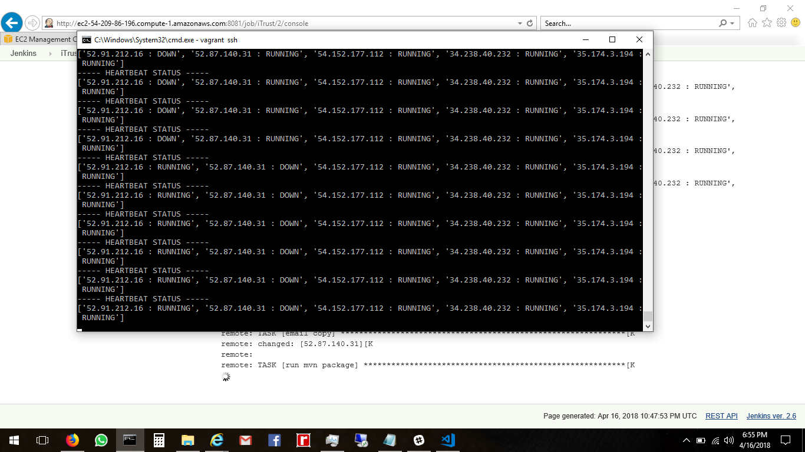

# Milestone 3 - Infrastructure and Deployment

## Contribution:

- Anshuman Goel (agoel5) : Kubernetes and Rolling updates
- Divya Guttikonda (dguttik) : Canary 
- Sarat Kavuru (skavuru) : Git hooks and deployment on AWS
- Tanmay Goel (tgoel) : Kubernetes and Redis

## Screencast
[Screencast for Demo of  Infrastructure and Deployment Milestone](https://youtu.be/1iDUMS-HSj8)

## Report

### Few Notes:

- The ansible-vault file should be named __credys.yml__ and the following credentials should be stored in as key:value pairs (DOTOKEN : 'xxx').
  - AWSAccessKeyId
  - AWSSecretKey
  - git_username
  - git_password
  - vault_password
 - AWSAccessKeyId, AWSSecretKey are the accesskeyId and secretKey of an AWS account and git_username, git_password  are the username and password of a Github Ncsu Enterprise account while vault_password is the password of the ansible vault.
- Create an SSH key pair with the name DevOps with your AWS account and store the file in the [Milestone3](../Milestone3) directory. Make sure that this key file has read-write permissions 0400 or 0600.
- All the variables required for [checkbox.io](https://github.com/anshuman-goel/checkbox.io) are in the file [checkboxvar.yml](../Milestone3/checkboxvar.yml) and they can be modified as required.
- The Node.js file [aws.js](../Milestone3/aws.js) should always be called with ServerName as an argument while the number of servers is optional.
- The commands to run each playbook are placed as comment at the top of of each playbook.
- The ansible-playbook [node.yml](../Milestone3/node.yml) is used to configure a local vm and then run aws.js to provision a remote server for Jenkins.
- The ansible-playbook [JenkinsConfig.yml](../Milestone3/JenkinsConfig.yml) is used to install all the dependencies, setup Jenkins  setup jenkins jobs for Checkbox and iTrust and start the build on a remote server.
- [DockerfileCheckBox](../Milestone3/DockerfileCheckBox) , [DockerfileCheckBoxCanary](../Milestone3/DockerfileCheckBoxCanary), [DockerfileRedisMaster](../Milestone3/DockerfileRedisMaster) and [DockerfileMongoDB](../Milestone3/DockerfileMongoDB) are files used in configuring the kubernetes cluster and implementing a canary release for checkbox.io application.
- [iTrust.yml](../Milestone3/iTrust.yml) and [CheckBox.yml](../Milestone3/CheckBox.yml) are the ansible playbooks that can deploy the respective applications on a remote server.
- [iTrustBuild.yml](../Milestone3/iTrustBuild.yml) and [CheckBoxBuild.yml](../Milestone3/CheckBoxBuild.yml) are the yml files which are parsed by the jenkins job builder to create jobs for iTrust and Checkbox on Jenkins server. In the post-build, they execute a script that installs a git hook on the Jenkins server which triggers deployment on a git push to production.
- [Kubernetes.yml](../Milestone3/kubernetes.yml) 
- [rollingiTrust.yml](../Milestone3/rollingiTrust.yml) 
- [monitoring.py](../Milestone3/monitoring.py) 
- The ansible-playbook [milestone3.yml](../Milestone3/milestone3.yml) is an outer level playbook which executes node.yml and JenkinsConfig.yml playbook and thus automating the entire Milestone 3 to a single step.

### Deployment

In this requirement, we created a git hook very similar to the workshops in the post build script of the jenkins build job. Thus, whenever a build is initiated, at first it will build the project and in post build will create a hook. Also in post build script, a some random commit is made and push is triggered. The triggered push will instantiated the EC2 machine and deploy the checkbox and itrust application. In case of Checkbox it will be deployed on Kubernetes cluster while for iTrust it will be deployed on 5 different EC2 instances. The post build stuff can be found in `CheckBoxBuild.yml` and `iTrustBuild.yml`.

### Infrastructure Upgrade

The file `Kubernetes.yml` deploys the Kubernetes cluster on AWS using `kubectl`, `kops` and `aws-cli`. It also deploys `MongoDB` (`MongoDBDeploy.yml`), `nginx`, `Checkbox` (`CheckboxDeploy.yml`) and `Redis` (`RedisMasterDeploy.yml`). Since Kubernetes needs docker images to be deployed on pods. The corresponding docker images have already been created and hosted on Dockerhub publicly, so that pods can download those images directly. The `DockerfileCheckBox` builds the `nginx`, `Checkbox`, and `Redis-client` image all together. While `DockerfileMongoDB` build the image for `MongoDB` and `DockerfileRedisMaster` handles the redis-server installtion on a different pod just like MongoDB.

Also, code of `server.js` has been modified a bit to show of a feature flag implementation in `Checkbox`. The repository for the same is located @ [https://github.com/anshuman-goel/checkbox.io]( https://github.com/anshuman-goel/checkbox.io ).

Apart from creating deployment, their corresponding services are also created. And for nginx one, a load-balancer is also build to make it accessible to outside world.

### Canary Release

To show the Canary release the original `Checkbox` is used without any modification. The Dockefile for the same is `DockerfileCheckBoxCanary`. The Canary part is handled in Kubernetes using `CheckboxDeploy.yml`. Since, a load-balancer, is used which by default uses round-robin fashion for serving requests. 25% of the traffic is divereted to the Canary one.

### Rolling Update

After all the 5 instances are up and rulling, `rollingiTrust.yml` handles the Rolling update. It firstly kills the process on one instance and re-deploy it. And do it one by one for all the instances. The `monitoring.py` has the heartbeat mechanism which shows the availability of all 5 instances. In output one can easily see the rolling update.

 - __Heartbeat status monitor for iTrust__ 

 